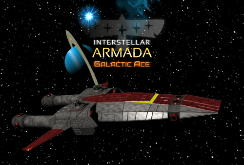

Interstellar Armada: Galactic Ace is a free, Open Source browser-based 3D space 
combat simulator developed in JavaScript-WebGL by Krisztián Nagy (<nkrisztian89@gmail.com>).

Play now!
=========

Though the game is far from being ready, it is possible to try out what has already
been completed from it. **Just head to [this page](https://nkrisztian89.github.io/interstellar-armada/) 
to launch the latest alpha release right in your browser.**

If you experience performance issues, adjust the level of graphics detail from the menu.
Or if you have a powerful computer, you might want to increase the default settings.
As this is an early version, the performance is subject to changes (and bugs).
The perfomance also greatly varies depending on the used browser. In my experience,
on most configurations **Chrome** provides the best experience.

With game related questions, suggestions and feedback please contact me at
<armada.galactic.ace@gmail.com>.

For developers
==============

I use [NetBeans](https://netbeans.org/) with its web development (+
[ESLint](https://github.com/joakim-eriksson/nb-eslint) and GLSL) plugins 
to develop this game. To build the game, you will need
[npm](https://www.npmjs.com/), [Grunt](https://gruntjs.com/) and 
[Sass](https://sass-lang.com/).

After cloning the repository, in its main folder run
```
npm install
grunt build
```
to build the production version of the game. Then serve the game folder with
your favorite server of choice and open `index.html` in the root folder to run
locally. (the game uses XMLHttpRequests, so the file cannot be opened directly
without a server)

Run `grunt clean` to remove the build files.

Run `grunt dev-build` to create a build for development / testing.

Run `grunt watch` while developing to automatically update dev-build files as you modify the sources.

Run `grunt build-with-editor` to create a production build that includes the game editor.

Editor
------

The game includes an editor (also written in JS, in fact it uses modules from the
game itself to load / display game data). You can open it by serving and opening
`editor.html` after making a dev-build (see the previous section).
Please note that the editor is even less complete than the game, there are
things that cannot be edited with it (most notably game configuration / settings and
language files), and it has limitations for even the things it can edit (such as not being
able to delete items). It is also fairly buggy.
However, it can still be useful and more comfortable than dealing with the JSON files manually, 
and can be great for understanding how the game data is structured. **To apply the changes
you make** in the editor, you need to **download the game files** to your computer and put them 
in your server's serving folder (or use Electron, as explained in the next chapter), **export 
the files you changed** with the editor (resources/classes/environments/mission), and **overwrite the 
original game files with the exported ones**.

Electron
--------

The game can be run using [Electron](https://www.electronjs.org/). To do this, just 
download a [release](https://github.com/electron/electron/releases) of Electron suitable for 
your computer, make a build of the game (see above), and then copy the project files over to the
appropriate folder of Electron (the `app` folder, which you will have to create within the `resources` folder).
The project contains the necessary files for the Electron setup, so after this it can simply be run by starting the Electron executable.
When run this way, the game has some small differences such as a Quit button in the menu to close the application and the
lack of a fullscreen button (as it will run in fullscreen by default).

The last release of Electron tested with the game: 8.2.0

Snap packaging
--------------

I have added added the files necessary to create a [snap package](https://snapcraft.io/) out of the game 
in the `snap` folder. I used Electron to create a standalone version of the app and then packaged it with snapcraft.
Everything was working in my tests except the sound. (which might be due to bad configuration or the limitations
of snap at the time I tried)

License and copyright
=====================

Please see the LICENSE.txt file or the About page within the game for the details of licensing.
In short, most of the source code of the game is released under the [GNU GPLv3](http://www.gnu.org/licenses/gpl-3.0-standalone.html) license
and most of the assets are released under the [CC BY 4.0](https://creativecommons.org/licenses/by/4.0/) license, but for exceptions,
details and attributions please do check LICENSE.txt.

Krisztián Nagy

30.11.2021.